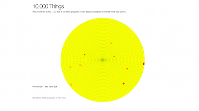
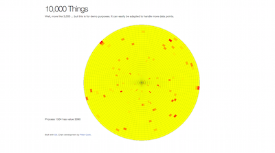
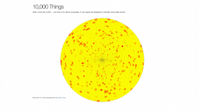
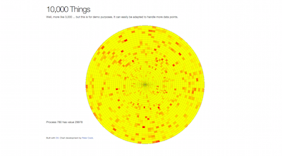
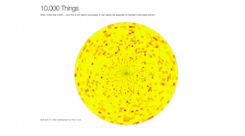

# laotzi-demo

*An LFE Demo of the Ten Thousand Things*


##### Table of Contents

* [Introduction](#introduction-)
* [Setup](#setup-)
  * [Bypassing localhost Default](#bypassing-localhost-default-)
* [Usage](#usage-)
* [Under the Hood](#under-the-hood-)
* [Ideas for Future Work](#ideas-for-future-work-)


## Introduction [&#x219F;](#table-of-contents)

Steven Proctor emailed Robert and I about an interesting LFE demo. This is the
demo that was born of that discussion.


## Setup [&#x219F;](#table-of-contents)

Just clone it:

```bash
$ git clone git@github.com:oubiwann/laotzi-demo.git
```

And then do :

```bash
$ make repl
```

This will download and compile all the dependencies, and then start the LFE
REPL (also automatically starting the ``laotzi-demo`` application and the
built-in web server).

### Bypassing ``localhost`` Default [&#x219F;](#table-of-contents)

If you'd like to run this demo's httpd server (which uses [barista](https://github.com/lfex/barista))
on the non-loopback network interface, you'll need to update the ``lfe.config`` file and change the
``#(host "localhost")`` tuple to point to your preferred IP or hostname.

## Usage [&#x219F;](#table-of-contents)

From the REPL where the ``laotzi-demo`` application has been started,
you can manually add children to the supervisor with the following:

```cl
> (laotzi-demo:add)
#(ok <0.60.0>)
> (laotzi-demo:add)
#(ok <0.62.0>)
> (laotzi-demo:add)
#(ok <0.64.0>)
> (laotzi-demo:add)
#(ok <0.66.0>)
> (laotzi-demo:add)
#(ok <0.68.0>)
> (laotzi-demo:add)
#(ok <0.70.0>)
> (laotzi-demo:add)
#(ok <0.72.0>)
> (laotzi-demo:add)
#(ok <0.74.0>)
> (laotzi-demo:get-children)
(#(undefined <0.64.0> worker (laotzi-demo-server))
 #(undefined <0.66.0> worker (laotzi-demo-server))
 #(undefined <0.68.0> worker (laotzi-demo-server))
 #(undefined <0.70.0> worker (laotzi-demo-server))
 #(undefined <0.72.0> worker (laotzi-demo-server))
 #(undefined <0.74.0> worker (laotzi-demo-server))
 #(undefined <0.60.0> worker (laotzi-demo-server))
 #(undefined <0.62.0> worker (laotzi-demo-server)))
```

You can add hundreds at a time with this function:

```cl
> (laotzi-demo:add 492)
ok
```

Or thousands:

```cl
> (laotzi-demo:add 2500)
ok
> (length (laotzi-demo:get-children))
3000
```

If you want to enable stats-gathering, do the following:

```cl
> (laotzi-demo:enable-stats)
ok
```

Let's make things interesting, and have the processes run code of varrying
number of calls:

```cl
> (laotzi-demo:execute-tasks)
#(ok #(interval #Ref<0.0.0.9074>))
```

You can have the demo start tracking stats (in this case, repeatedly saving
each process' number of reductions to ``./www/data.json``):

```cl
> (laotzi-demo:start-tracking)
#(ok #(interval #Ref<0.0.0.9079>))
```

With that done, we can now open http://localhost:5099/ in our browser, where
we will be greeted with something like the following:

<a src="resources/images/screenshot-0.png"></a>

As time passes, you'll see that heatmap evolve along these lines:

<a src="resources/images/screenshot-1.png"></a>

<a src="resources/images/screenshot-2.png"></a>

<a src="resources/images/screenshot-3.png"></a>

<a src="resources/images/screenshot-4.png"></a>

This page has jquery AJAX polling set up, so you should see changes every 8 seconds or so. This will chew up your CPU, so don't leave it running :-)


## Under the Hood [&#x219F;](#table-of-contents)

Here are the interesting things that this demo applications does:

* Creates an OTP application, supervisor, and then thousands of worker
  processes.

* Enables stats-gathering for the OTP supervisor.

* Generates a JSON data file from process stats.

* Uses an early, development version of the lmug web server middleware
  framework (inspired by Clojure's Ring framework, which in turn was
  inspired by Python's WSGI).

* As part of the above point, it uses a built-in web server.

* Generates json with the ljson LFE library for parsing and creating
  JSON data.

* Makes use of the d3.js data visualization library.


## Ideas for Future Work [&#x219F;](#table-of-contents)

Setting aside the features that need to be added to the various nascent dependencies, here are some cool things to do:

* Add support for websockets and streaming monitoring data
* Update the d3.js heatmap data one cell at a time, based upon stream data (using websockets)
* Demonstrate swapping out YAWS, Cowboy, and native httpd
* Make the d3.js example more configurable so that changing total nodes created from 3000 to 500 or to 10,000 doesn't involve changing code
* Show more than just reductions
* Use additional visualization metaphors
